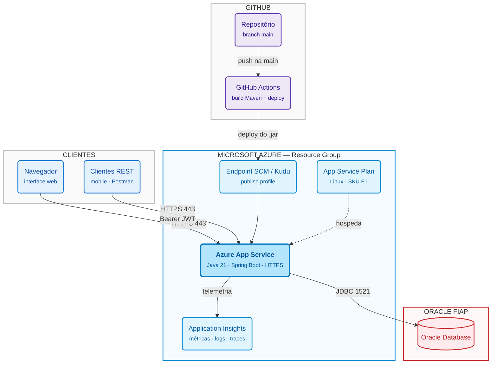
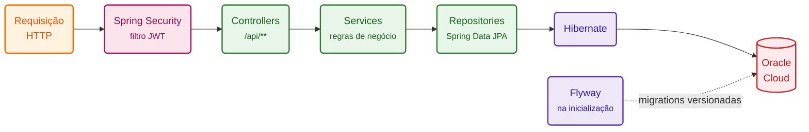
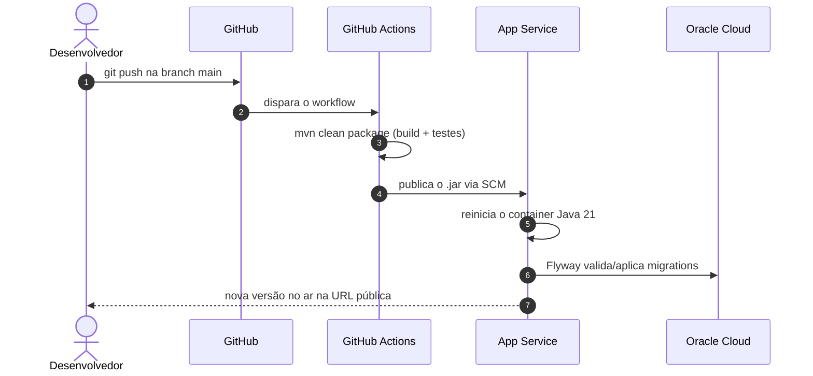
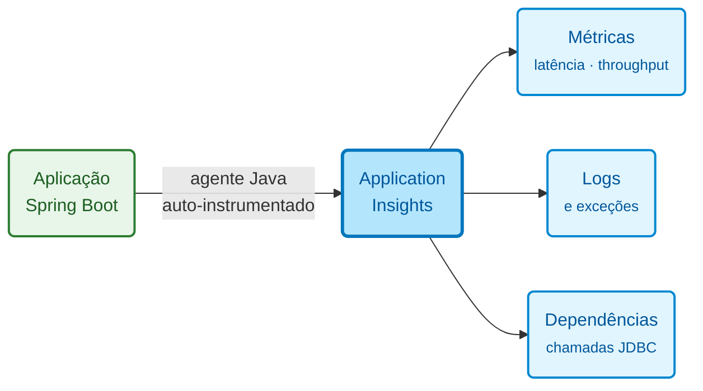

# YourPetHealth API - Sistema de Gestão Veterinária

Aplicação web e API REST para gestão de clínica veterinária, desenvolvida em Java com Spring Boot, Maven, JPA/Hibernate e Oracle Database. O sistema permite que tutores cadastrem seus pets e agendem consultas, e que veterinários consultem sua agenda, realizem atendimentos e registrem o histórico clínico dos animais.

---

# Objetivo

A aplicação auxilia no acompanhamento clínico contínuo de animais de estimação, permitindo:

- Cadastro e autenticação de tutores e veterinários
- Gestão dos pets de cada tutor
- Agendamento de consultas com validação de disponibilidade
- Registro de atendimentos pelo veterinário
- Histórico clínico gerado automaticamente a cada consulta concluída

A API foi desenvolvida utilizando arquitetura REST e persistência em banco de dados Oracle.

---

# Arquitetura da Solução

## Visão geral

A solução segue um modelo de **aplicação monolítica hospedada em PaaS com banco de dados externo gerenciado**. Não há infraestrutura de servidor sob nossa responsabilidade: o Azure App Service cuida do runtime Java e o Oracle Cloud cuida do banco. O que gerenciamos é o *código* e a *configuração*.

Essa escolha é deliberada. Para uma API CRUD com um único domínio coeso, containerizar manualmente ou quebrar em microsserviços adicionaria custo operacional sem benefício real — o App Service já resolve build, deploy, escala vertical, HTTPS e reinício automático.



## Recursos utilizados

**Microsoft Azure**
- **Resource Group** — agrupa todos os recursos da solução
- **App Service Plan** — Linux, SKU F1 (free tier)
- **App Service (Web App)** — hospeda o `.jar` do Spring Boot, runtime Java 21
- **Application Insights** — observabilidade da aplicação

**Externos**
- **GitHub Actions** — pipeline de CI/CD (build Maven e deploy)
- **Oracle FIAP** — banco de dados da aplicação

> O banco **não** é provisionado pelo script de deploy e **não** roda dentro do App Service. Ele já existe no Oracle Cloud e a aplicação se conecta a ele por JDBC, com credenciais injetadas como variáveis de ambiente. Destruir e recriar todo o ambiente Azure não afeta os dados.

## Camadas da aplicação

Dentro do App Service, a aplicação segue arquitetura em camadas:



- **Spring Security** valida o token JWT antes de qualquer controller ser alcançado; rotas de autenticação e a interface web ficam fora dessa exigência.
- **Controllers** expõem os endpoints REST e traduzem HTTP em chamadas de serviço — sem regra de negócio.
- **Services** concentram as validações (ex.: disponibilidade de horário no agendamento) e a orquestração entre entidades.
- **Repositories** abstraem o acesso ao banco via Spring Data JPA.
- **Flyway** roda na subida da aplicação e garante que o schema do Oracle esteja na versão esperada pelo código — o deploy do `.jar` e a evolução do banco acontecem juntos, sem passo manual.

---

# Fluxos de Funcionamento

## 1. Fluxo de deploy (CI/CD)

É o fluxo que caracteriza a esteira de DevOps: da alteração no código até a aplicação no ar, sem intervenção manual.



**Provisionamento inicial** (executado uma única vez, via `azure/deploy-azure.sh`):

1. Cria o Resource Group
2. Cria o Application Insights
3. Cria o App Service Plan (Linux, F1)
4. Cria o Web App com runtime Java 21
5. Habilita a autenticação básica no endpoint SCM — **é o que permite ao GitHub Actions publicar o artefato**
6. Recupera a connection string do Application Insights
7. Injeta as variáveis de ambiente da aplicação (banco, JWT, agente de telemetria)
8. Vincula o Web App ao Application Insights
9. Cria o workflow do GitHub Actions no repositório

A partir daí, o passo 1 do diagrama acima é o único necessário para novas versões.

## 2. Fluxo de observabilidade



A instrumentação é habilitada apenas por variáveis de ambiente (`ApplicationInsightsAgent_EXTENSION_VERSION`, `XDT_MicrosoftApplicationInsights_Mode`) — **nenhuma linha de código da aplicação precisa mudar**. O agente intercepta requisições HTTP e chamadas JDBC automaticamente, o que permite identificar se uma lentidão vem da aplicação ou da latência até o Oracle Cloud.

## Segurança e configuração

| Preocupação | Como é tratada |
|---|---|
| Credenciais do banco | Variáveis de ambiente no App Service (`SPRING_DATASOURCE_*`), nunca no repositório |
| Segredo do JWT | App Setting `JWT_SECRET`, injetado em runtime |
| Tráfego externo | HTTPS fornecido pelo App Service |
| Acesso à API | Token JWT obrigatório nas rotas `/api/**` |
| Credencial de deploy | Publish profile armazenado como secret no GitHub, criado automaticamente pelo Azure CLI |

---

# Como criar o Web App no Azure

O script de provisionamento está em **`azure/deploy-azure.sh`**.

## Pré-requisitos

- Azure CLI instalado e autenticado (`az login`)
- Permissão para criar recursos na assinatura do Azure
- Acesso de administrador ao repositório no GitHub
- Banco Oracle Cloud já existente e acessível (o script **não** cria o banco)

## Passo a passo

**1. Entre na pasta do script**

```bash
cd azure
```

**2. Execute o script**

```bash
./deploy-azure.sh
```

Ele executa os nove passos de provisionamento em sequência — cada comando só roda após o anterior concluir, e o script aborta se qualquer etapa falhar.

**3. Autorize o GitHub quando solicitado**

O último comando (`az webapp deployment github-actions add`) abre um fluxo de autorização do GitHub no navegador. Sem essa autorização o workflow não é criado no repositório.

**4. Acompanhe o primeiro deploy**

O Azure cria o arquivo `.github/workflows/*.yml` no repositório e dispara o primeiro build automaticamente. Acompanhe em **GitHub → Actions**.

## Depois do primeiro deploy

- Todo push na branch `main` dispara build e deploy automaticamente — o script **não** precisa ser executado de novo.
- Para trocar segredos (senha do banco, `JWT_SECRET`), altere em **App Service → Configuration → Application settings**; o Web App reinicia sozinho.
- Métricas e logs ficam no recurso de Application Insights criado.
- Para destruir todo o ambiente: `az group delete --name $RESOURCE_GROUP_NAME`. O banco no Oracle Cloud permanece intacto.